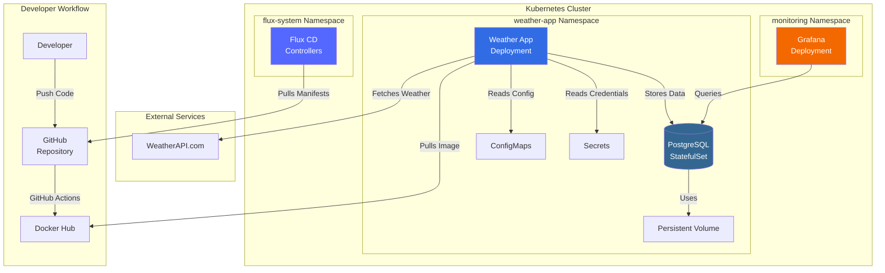

# Weather Monitoring System 🌤️

[](https://opensource.org/licenses/MIT)
[](https://kubernetes.io/)
[](https://www.docker.com/)
[](https://www.python.org/)
[](https://www.postgresql.org/)

**A production-grade Kubernetes-native weather monitoring system demonstrating GitOps, observability, and cloud-native best practices.**

---

## 🌟 Features

- ✅ **Automated Weather Data Collection** - Polls WeatherAPI.com at configurable intervals
- ✅ **PostgreSQL Persistent Storage** - Stores historical weather data with StatefulSet
- ✅ **Grafana Dashboards** - Real-time visualization of weather metrics
- ✅ **GitOps Deployment** - Declarative infrastructure with Flux CD
- ✅ **Prometheus Metrics** - Custom application metrics for monitoring
- ✅ **Health Checks** - Kubernetes liveness and readiness probes
- ✅ **CI/CD Pipeline** - Automated Docker builds with GitHub Actions
- ✅ **Security Hardened** - Non-root containers, network policies, secret management
- ✅ **Graceful Shutdown** - Proper signal handling for zero-downtime updates

---

## 🏗️ Architecture



### Component Overview

| Component | Technology | Purpose |
|-----------|-----------|---------|
| **Weather App** | Python 3.9 | Collects weather data and stores in database |
| **PostgreSQL** | PostgreSQL 14 | Persistent data storage |
| **Grafana** | Grafana Latest | Data visualization and dashboards |
| **Flux CD** | FluxCD v2 | GitOps continuous deployment |
| **Prometheus** | Prometheus Client | Application metrics and monitoring |

---

## 🛠️ Technologies Used

### Core Stack
- **Container Orchestration**: Kubernetes (K3s)
- **GitOps**: Flux CD
- **Database**: PostgreSQL 14 with persistent volumes
- **Monitoring**: Grafana + Prometheus metrics
- **CI/CD**: GitHub Actions
- **Language**: Python 3.9
- **Infrastructure**: Kubernetes manifests with Kustomize

### Python Libraries
- `requests` - HTTP client for weather API
- `psycopg2-binary` - PostgreSQL database adapter
- `prometheus-client` - Metrics exposition
- `python-dotenv` - Environment configuration

---

## 📋 Prerequisites

Before running this project, ensure you have:

- **Docker Desktop** (v20.10+)
- **kubectl** (v1.24+)
- **k3s** or any Kubernetes cluster (v1.24+)
- **Flux CLI** (v2.0+)
- **Git** (v2.30+)
- **Python 3.9+** (for local development)
- **WeatherAPI.com API Key** ([Get free key](https://www.weatherapi.com/))

---

## 🚀 Quick Start

### 1. Clone the Repository

```bash
git clone https://github.com/Urten/homelab_weather-app.git
cd homelab_weather-app
```

### 2. Set Up Environment Variables

```bash
cp .env.example .env
# Edit .env and add your WeatherAPI.com API key
```

### 3. Install k3s (if not already installed)

```bash
chmod +x k3s/install.sh
./k3s/install.sh
```

### 4. Setup Flux CD

```bash
export GITHUB_TOKEN=your_github_personal_access_token
export GITHUB_USER=your_github_username

chmod +x scripts/setup-flux.sh
./scripts/setup-flux.sh
```

### 5. Create Kubernetes Secrets

```bash
chmod +x scripts/generate-secrets.sh
./scripts/generate-secrets.sh
```

### 6. Build and Push Docker Image

```bash
cd app
docker build -t your-dockerhub-username/weather-app:latest .
docker push your-dockerhub-username/weather-app:latest
```

### 7. Deploy to Kubernetes

Flux will automatically deploy the application from the GitOps repository.

```bash
# Watch the deployment
kubectl get pods -n weather-app -w
```

---

## 🧪 Development

### Local Development Setup

1. **Create a Python virtual environment:**
   ```bash
   python -m venv venv
   source venv/bin/activate  # On Windows: venv\Scripts\activate
   ```

2. **Install dependencies:**
   ```bash
   pip install -r app/requirements.txt
   ```

3. **Run locally:**
   ```bash
   # Make sure you have .env file configured
   python app/weather_app.py
   ```

### Running Tests

```bash
# Install test dependencies
pip install pytest pytest-cov

# Run tests
pytest tests/ -v

# Run with coverage
pytest tests/ --cov=app --cov-report=html
```

---

## 📊 Monitoring & Observability

### Health Endpoints

The application exposes three health endpoints on port 8080:

- **`/health`** - Liveness probe (returns 200 if app is running)
- **`/ready`** - Readiness probe (returns 200 if database is connected)
- **`/metrics`** - Prometheus metrics endpoint

### Example Health Check

```bash
kubectl port-forward -n weather-app deployment/weather-app 8080:8080

# In another terminal
curl http://localhost:8080/health
curl http://localhost:8080/ready
curl http://localhost:8080/metrics
```

### Prometheus Metrics

The application exposes custom metrics:

- `weather_api_requests_total` - Total API requests made
- `weather_api_errors_total` - Total API errors
- `db_operations_total{operation}` - Database operations by type
- `db_errors_total` - Database errors
- `current_temperature_celsius{city, country}` - Current temperature
- `current_humidity_percent{city, country}` - Current humidity
- `current_pressure_mb{city, country}` - Current pressure
- `weather_fetch_duration_seconds` - API fetch duration histogram

### Accessing Grafana

```bash
# Port forward to Grafana
kubectl port-forward -n monitoring service/grafana 3000:80

# Open browser to http://localhost:3000/grafana
```

---

## 🔍 Troubleshooting

### Check Application Logs

```bash
# View weather app logs
kubectl logs -f deployment/weather-app -n weather-app

# View PostgreSQL logs
kubectl logs -f statefulset/postgres -n weather-app

# View Grafana logs
kubectl logs -f deployment/grafana -n monitoring
```

### Check Database

```bash
# Connect to PostgreSQL
kubectl exec -it statefulset/postgres -n weather-app -- psql -U postgres -d weather_db

# Query weather data
SELECT * FROM weather_data ORDER BY timestamp DESC LIMIT 10;
```

### Common Issues

**Problem**: Pod stuck in `ImagePullBackOff`
- **Solution**: Verify Docker image name in `deployment.yaml` matches your Docker Hub image

**Problem**: Pod shows `CrashLoopBackOff`
- **Solution**: Check that all secrets are created: `kubectl get secrets -n weather-app`

**Problem**: Database connection errors
- **Solution**: Ensure PostgreSQL pod is running: `kubectl get pods -n weather-app`

**Problem**: Grafana can't connect to database
- **Solution**: Verify `grafana_reader` user exists in PostgreSQL

---

## 🔐 Security Considerations

This project implements several security best practices:

- ✅ **Secrets Management** - Kubernetes secrets (can be enhanced with Sealed Secrets)
- ✅ **Non-root Containers** - All containers run as unprivileged users
- ✅ **Read-only Filesystem** - Where applicable
- ✅ **Dropped Capabilities** - Minimal container privileges
- ✅ **Network Policies** - (Optional) Restrict pod-to-pod communication
- ✅ **Resource Limits** - CPU and memory limits prevent resource exhaustion

### Creating Production Secrets

For production, use sealed secrets or external secret managers:

```bash
# Example: Using Bitnami Sealed Secrets
kubectl create secret generic weather-api-secret \
  --from-literal=api-key=your_real_api_key \
  --dry-run=client -o yaml | \
  kubeseal -o yaml > sealed-secret.yaml
```

---

## 📁 Project Structure

```
weather-monitoring-system/
├── .github/
│   └── workflows/
│       └── docker-build.yaml         # CI/CD pipeline for Docker builds
├── app/
│   ├── __init__.py                   # Package initialization
│   ├── weather_app.py                # Main application with metrics & health checks
│   ├── requirements.txt              # Python dependencies
│   ├── Dockerfile                    # Container image definition
│   └── .dockerignore                 # Docker build exclusions
├── gitops/
│   └── clusters/
│       └── my-cluster/
│           ├── flux-system/          # Flux CD bootstrap manifests
│           ├── weather-app/          # Application manifests
│           │   ├── namespace.yaml
│           │   ├── configmap.yaml
│           │   ├── deployment.yaml   # With probes & security context
│           │   ├── postgres.yaml     # StatefulSet with PVC
│           │   ├── kustomization.yaml
│           │   └── secrets.example.yaml
│           └── grafana/              # Grafana deployment manifests
├── k3s/
│   └── install.sh                    # K3s installation script
├── scripts/
│   ├── setup-flux.sh                 # Flux bootstrap script
│   └── generate-secrets.sh           # Secret generation helper
├── .env.example                      # Environment variable template
├── .gitignore                        # Git exclusions
├── LICENSE                           # MIT License
└── README.md                         # This file
```

---

## 📖 Documentation

- **[Architecture Details](ARCHITECTURE.md)** - Deep dive into design decisions (coming soon)
- **[Security Approach](SECURITY.md)** - Security best practices (coming soon)
- **[Change Log](CHANGELOG.md)** - Version history (coming soon)

---

## 🤝 Contributing

Contributions are welcome! Please follow these steps:

1. Fork the repository
2. Create a feature branch (`git checkout -b feature/AmazingFeature`)
3. Commit your changes (`git commit -m 'Add some AmazingFeature'`)
4. Push to the branch (`git push origin feature/AmazingFeature`)
5. Open a Pull Request

---

## 📄 License

This project is licensed under the MIT License - see the [LICENSE](LICENSE) file for details.

---

## 🎯 Project Goals & Learning Objectives

This project was built to demonstrate:

- ✅ **Production-ready Kubernetes deployment patterns**
  - Health checks, resource limits, security contexts
  - StatefulSets for stateful applications
  - ConfigMaps and Secrets management

- ✅ **GitOps workflows with Flux CD**
  - Declarative infrastructure
  - Automated synchronization
  - Version-controlled deployments

- ✅ **Observability and monitoring best practices**
  - Prometheus metrics exposition
  - Grafana dashboards
  - Structured logging

- ✅ **Security-conscious infrastructure design**
  - Non-root containers
  - Secret management
  - Least-privilege access

- ✅ **CI/CD automation**
  - GitHub Actions for builds
  - Automated testing
  - Container registry integration

---

## 👤 Author

**Boris Urten**

- GitHub: [@Urten](https://github.com/Urten)

---

## 🙏 Acknowledgments

- [WeatherAPI.com](https://www.weatherapi.com/) for providing the weather data API
- [Flux CD](https://fluxcd.io/) for GitOps tooling
- [K3s](https://k3s.io/) for lightweight Kubernetes
- [Grafana](https://grafana.com/) for visualization
- [Prometheus](https://prometheus.io/) for monitoring

---

## 📝 Notes

- The application polls weather data every 5 minutes by default (configurable via `UPDATE_INTERVAL`)
- Database uses persistent volumes - data survives pod restarts
- Grafana requires manual dashboard import (dashboard JSON coming soon)
- For production use, implement proper backup strategies for PostgreSQL
